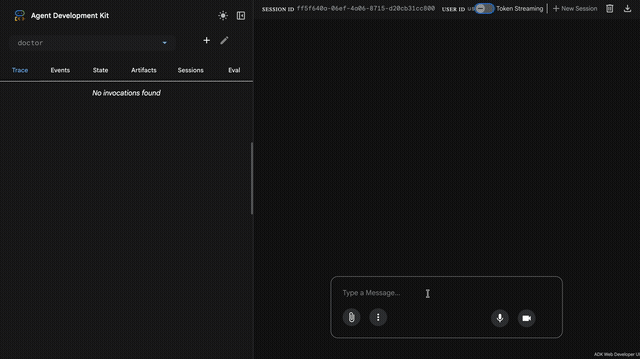
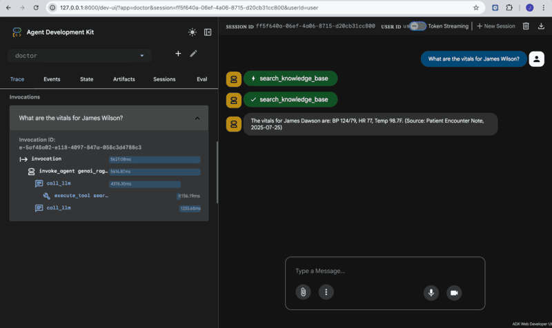
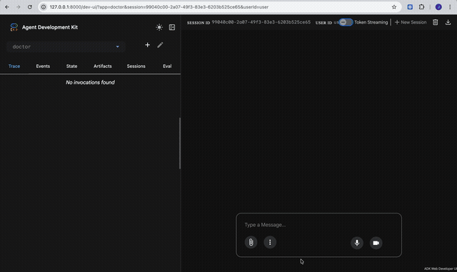
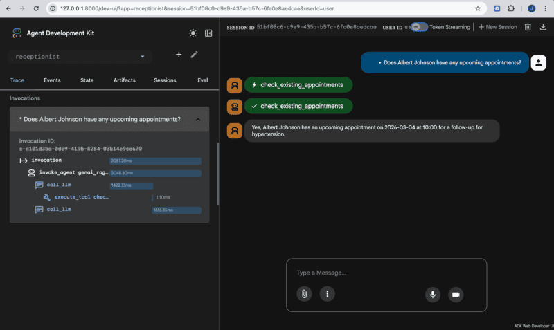
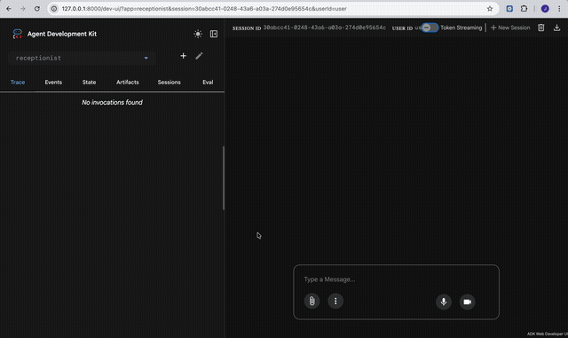
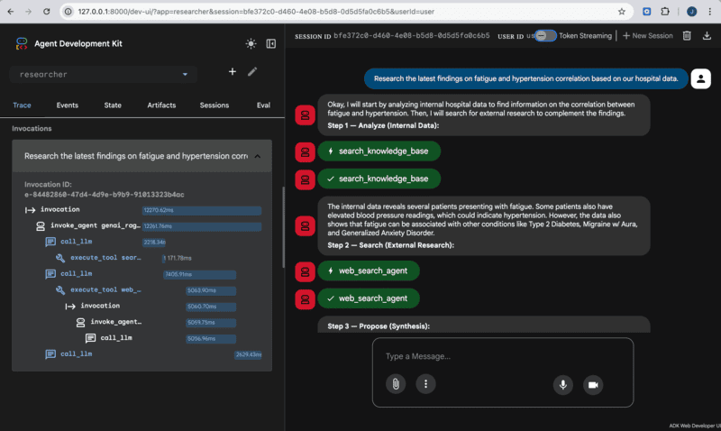
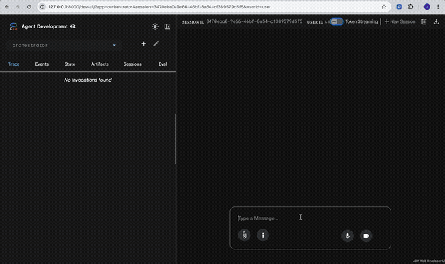
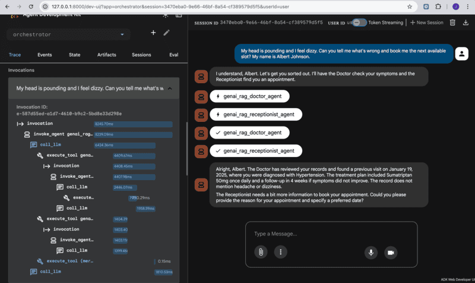
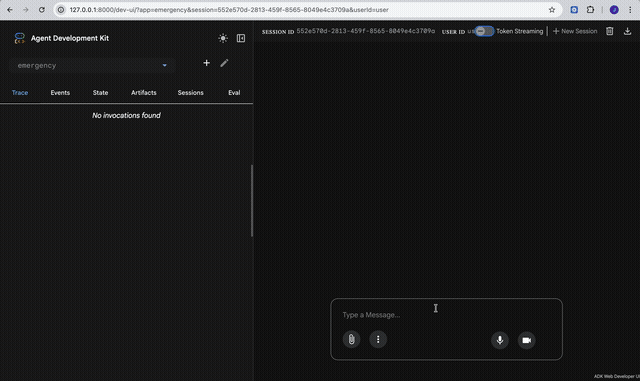
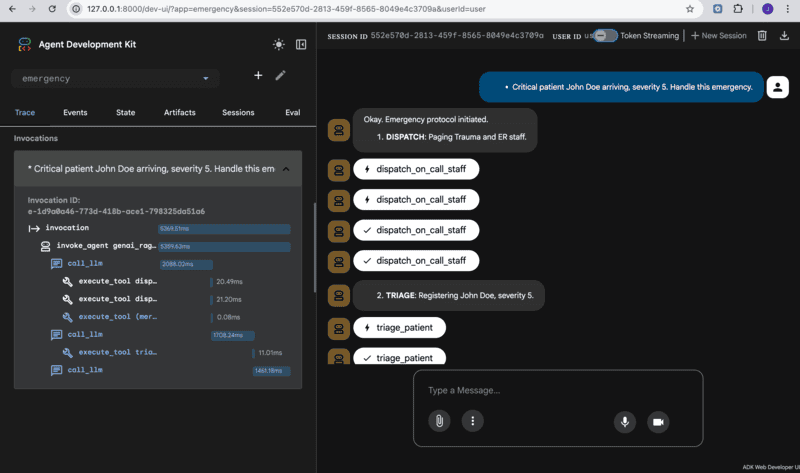

# Multi-Agent Hospital System with Vertex AI Search & ADK

This project is a modular, multi-agent ecosystem built using the Google Agent Development Kit (ADK) and Vertex AI Search. It transforms a standard RAG prototype into a coordinated team of specialized agents designed to handle clinical, administrative, and research tasks within a hospital environment.

## Architecture Overview

The system transitions from a single chatbot to a hierarchy of specialized personas:

*   **🩺 The Doctor Agent:** A clinical resident specialist. It uses RAG to reason over private medical records and provide grounded, cited answers.
*   **🗓️ The Receptionist Agent:** An administrative specialist. It uses the Model Context Protocol (MCP) to manage appointment scheduling and check availability.
*   **🔬 The Researcher Agent:** An academic explorer. It synthesizes local patient data with global medical research using Google Search and multi-agent synthesis.
*   **👑 The Orchestrator Agent ("Final Boss"):** The system's triage specialist. It analyzes user intent and delegates tasks to the appropriate sub-agent using Agent-as-a-Tool (A2A) integration.
*   **🚨 The Emergency Agent:** A crisis management specialist. It interacts with a live hospital simulation (via an MCP server) to triage patients and allocate critical resources during emergencies.

---

## 🎮 Demo Results

### Level 1 — Doctor Agent (RAG & Grounded Reasoning)
> Clinical resident that searches hospital records via Vertex AI Search to provide grounded, cited medical answers.

<details>
<summary>📹 Watch demo</summary>
<br>

</details>

<p>

</p>

---

### Level 2 — Receptionist Agent (Appointments & Medication Tools)
> Hospital receptionist that manages appointments, checks schedules, and tracks medication collection status.

<details>
<summary>📹 Watch demo</summary>
<br>

</details>

<p>

</p>

---

### Level 3 — Researcher Agent (Multi-Tool Academic Explorer)
> Academic explorer that synthesizes internal hospital data with global medical literature via Google Search.

<details>
<summary>📹 Watch demo</summary>
<br>

</details>

<p>

</p>

---

### Level 4 — Orchestrator Agent (Multi-Agent Triage Coordinator)
> Nurse Atlas — a triage specialist that routes requests to Doctor, Receptionist, and Researcher sub-agents using Agent-as-a-Tool.

<details>
<summary>📹 Watch demo</summary>
<br>

</details>

<p>

</p>

---

### Level 5 — Emergency Agent (Crisis Management via MCP)
> Code Blue coordinator that connects to a live Hospital Information System via MCP to triage patients and dispatch staff.

<details>
<summary>📹 Watch demo</summary>
<br>

</details>

<p>

</p>

---

## How It Works

The application operates in two primary modes:

1.  **Ingestion (`--mode ingest`):** Processes unstructured documents (PDFs) from `data/raw/`, parses them, and indexes them into a Vertex AI Search data store for use by the Doctor and Researcher agents.
2.  **Chat (`--mode chat`):** Launches an interactive CLI. You can now specify which agent you want to converse with using the `--agent` flag.

---

## Key Commands

### Setup
-   `make install`: Installs all project dependencies using Poetry.
-   `make infra`: Provisions required GCP infrastructure (Data Store, Engine, GCS Buckets).

### Running the Application
- **Ingest Data:**
    ```bash
    poetry run python main.py --mode ingest
    ```
- **Chat via Web UI (Recommended):**
    This launches a local web-based playground where you can select between different agents (Doctor, Receptionist, etc.) and view tool calls in real-time.
    ```bash
    poetry run adk web src/agents
    ```
- **Chat via CLI:**
    ```bash
    # Chat with the Doctor (Default)
    poetry run python main.py --mode chat --agent doctor

    # Chat with the Receptionist
    poetry run python main.py --mode chat --agent receptionist
    ```

-   **Evaluate Performance:**
    ```bash
    poetry run python scripts/run_evaluation.py
    ```

---

## Project Documentation

-   **[AGENT_ARCHITECTURE.md](./AGENT_ARCHITECTURE.md):** Detailed technical breakdown of the multi-agent flow and A2A integration.
-   **[SETUP.md](./SETUP.md):** Guide for installation and configuration.
-   **[INFRASTRUCTURE_SETUP.md](./INFRASTRUCTURE_SETUP.md):** Step-by-step GCP resource provisioning.
-   **[task-tracker.md](./task-tracker.md):** Current progress of the system migration.
